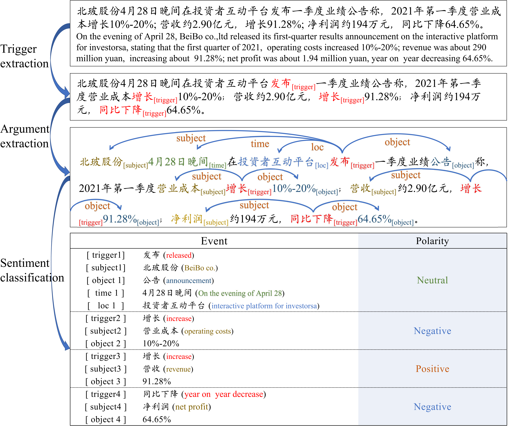

# E<sup>3</sup>SA

Source dataset for the paper,“Enhancing Event-Level Sentiment Analysis with Structured Arguments”. 

## Overview

**Structured Event-level sentiment analysis** (Event-level SA)  is urgently demanded in many applications but faces four major challenges:

- The multi-subtasks (e.g., trigger extraction, argument extraction, sentiment classification) related with each other, and performing them independently will lead to the error propagation;
- One short document may contain more than one event with different sentiments;
- Unlike general aspect-level SA, the event consists of trigger and arguments associated with roles (e.g., subject, object, time, and location), which is harder to model than the topic. Thus, the existing aspect-based sentiment analysis models can not be applied to this task directly;
- Lack of the labeled dataset for this task. 

Below we show an example to intuitively illustrate these four challenges.



To combat aforementioned challenges, we propose an End-to-End Event-level Sentiment Analysis( **E<sup>3</sup>SA **) framework to model the relationships among the multi-subtasks and multi-events by taking structured elements into account. 

In general, the end-to-end event-level SA needs to complete the following tasks jointly:

- **Trigger extraction**
- **Argument extraction**
- **Sentiment classification**

How can **E<sup>3</sup>SA **achieve this?

(1) contextualized word embedding module that models the document with contextual representation; 

(2) feature-enhanced trigger extractor that extracts all the triggers in the documents with extra features such as POS and NER labels; 

(3) argument extractor that extracts the arguments concerning the given trigger by taking trigger information into account; 

(4) sentiment classifier that judges the sentiment polarities of the events with argument information.

The following figure shows the overall architecture of  **E<sup>3</sup>SA **, for more details, please refer to our paper.


## Dataset

We collect and label a real-world dataset in the finance domain for this task (C4). This dataset provides a new perspective for SA and a new benchmark for event-level SA.

Run `unzip Data.zip`

## Citation
If you find our work interesting, you can cite the paper as

```
@inproceedings{zhang2022enhancing,
               title={Enhancing Event-Level Sentiment Analysis with Structured Arguments},
               author={Zhang, Qi and Zhou, Jie and Chen, Qin and Bai, Qingchun and He, Liang},
               booktitle={SIGIR},
               year={2022}
}
```
